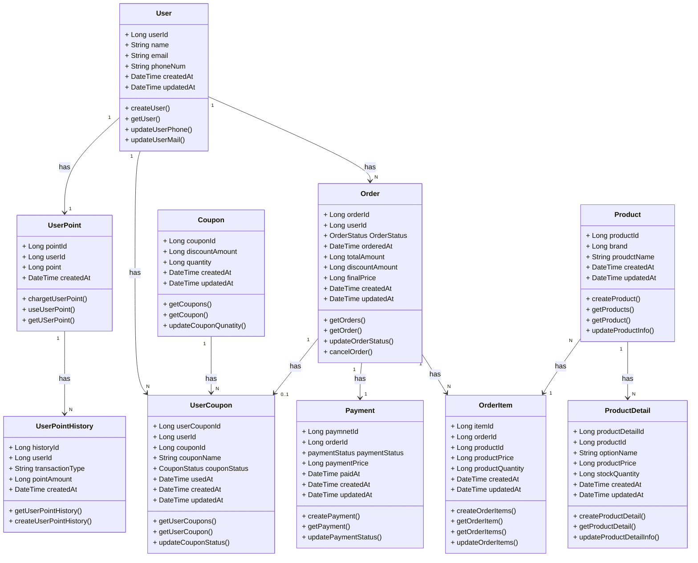

```mermaid
classDiagram
    User "1" --> "1" UserPoint : has
    User "1" --> "N" UserCoupon : has
    User "1" --> "N" Order : has
    UserPoint "1" --> "N" UserPointHistory : has
    Coupon "1" --> "N" UserCoupon : has
    Order "1" --> "0..1" UserCoupon : has
    Order "1" --> "1" Payment: has
    Order "1" --> "N" OrderItem: has
    Product "N" --> "1" OrderItem : has
    Product "1" --> "N" ProductDetail : has

    class User {
        + Long userId
        + String name
        + String email
        + String phoneNum
        + DateTime createdAt
        + DateTime updatedAt
        + createUser()
        + getUser()
        + updateUserPhone()
        + updateUserMail()
    }
    class UserPoint {
        + Long pointId
        + Long userId
        + Long point
        + DateTime createdAt
        + chargetUserPoint()
        + useUserPoint()
        + getUSerPoint()
    }

    class UserPointHistory {
        + Long historyId
        + Long userId
        + String transactionType
        + Long pointAmount
        + DateTime createdAt
        + getUserPointHistory()
        + createUserPointHistory()
    }

    class Coupon {
        + Long couponId
        + Long discountAmount
        + Long quantity
        + DateTime createdAt
        + DateTime updatedAt
        + getCoupons()
        + getCoupon()
        + updateCouponQunatity()
    }

    class UserCoupon {
        + Long userCouponId
        + Long userId
        + Long couponId
        + String couponName
        + CouponStatus couponStatus
        + DateTime usedAt
        + DateTime createdAt
        + DateTime updatedAt
        + getUserCoupons()
        + getUserCoupon()
        + updateCouponStatus()
    }

    class Order {
        + Long orderId
        + Long userId
        + OrderStatus OrderStatus
        + DateTime orderedAt
        + Long totalAmount
        + Long discountAmount
        + Long finalPrice
        + DateTime createdAt
        + DateTime updatedAt
        + getOrders()
        + getOrder()
        + updateOrderStatus()
        + cancelOrder()
    }

    class Payment {
        + Long paymnetId
        + Long orderId
        + paymentStatus paymentStatus
        + Long paymentPrice
        + DateTime paidAt
        + DateTime createdAt
        + DateTime updatedAt
        + createPayment()
        + getPayment()
        + updatePaymentStatus()
    }

    class OrderItem {
        + Long itemId
        + Long orderId
        + Long productId
        + Long productPrice
        + Long productQuantity
        + DateTime createdAt
        + DateTime updatedAt
        + createOrderItems()
        + getOrderItem()
        + getOrderItems()
        + updateOrderItems()
    }

    class Product {
        + Long productId
        + Long brand
        + String proudctName
        + DateTime createdAt
        + DateTime updatedAt
        + createProduct()
        + getProducts()
        + getProduct()
        + updateProductInfo()
    }

    class ProductDetail {
        + Long productDetailId
        + Long productId
        + String optionName
        + Long productPrice
        + Long stockQuantity
        + DateTime createdAt
        + DateTime updatedAt
        + createProductDetail()
        + getProductDetail()
        + updateProductDetailInfo()
    }
```