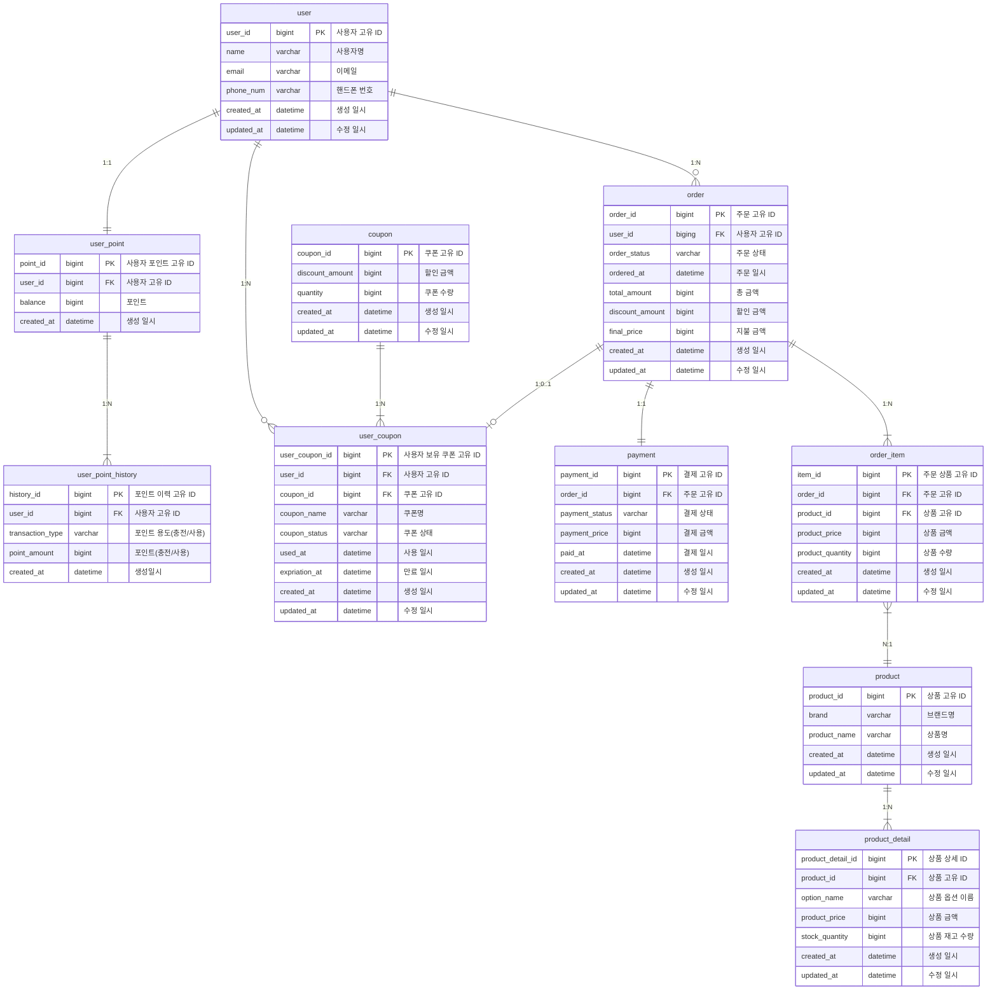

```mermaid
erDiagram
    user ||--|| user_point : "1:1"
    user_point ||--|{ user_point_history : "1:N"
    user ||--o{ user_coupon : "1:N"
    user ||--o{ order : "1:N"

    coupon ||--|{ user_coupon : "1:N"

    order ||--|| payment : "1:1"
    order ||--|{ order_item: "1:N"
    order ||--o| user_coupon : "1:0..1"

    order_item |{--|| product : "N:1"
    product ||--|{ product_detail : "1:N"

    user {
        user_id bigint PK "사용자 고유 ID"
        name varchar "사용자명"
        email varchar "이메일"
        phone_num varchar "핸드폰 번호"
        created_at datetime "생성 일시"
        updated_at datetime "수정 일시"
    }

    user_point {
        point_id bigint PK "사용자 포인트 고유 ID"
        user_id bigint FK "사용자 고유 ID"
        balance bigint "포인트"
        created_at datetime "생성 일시"
    }

    user_point_history {
        history_id bigint PK "포인트 이력 고유 ID"
        user_id  bigint FK "사용자 고유 ID"
        transaction_type varchar "포인트 용도(충전/사용)"
        point_amount bigint "포인트(충전/사용)"
        created_at datetime "생성일시"
    }

    user_coupon {
        user_coupon_id bigint PK "사용자 보유 쿠폰 고유 ID"
        user_id bigint FK "사용자 고유 ID"
        coupon_id bigint FK "쿠폰 고유 ID"
        coupon_name varchar "쿠폰명"
        coupon_status varchar "쿠폰 상태"
        used_at datetime "사용 일시"
        expriation_at datetime "만료 일시"
        created_at datetime "생성 일시"
        updated_at datetime "수정 일시"
    }

    coupon {
        coupon_id bigint PK "쿠폰 고유 ID"
        discount_amount bigint "할인 금액"
        quantity bigint "쿠폰 수량"
        created_at datetime "생성 일시"
        updated_at datetime "수정 일시"
    }

    order {
        order_id bigint PK "주문 고유 ID"
        user_id biging FK "사용자 고유 ID"
        order_status varchar "주문 상태"
        ordered_at datetime "주문 일시"
        total_amount bigint "총 금액"
        discount_amount bigint "할인 금액"
        final_price bigint "지불 금액"
        created_at datetime "생성 일시"
        updated_at datetime "수정 일시"
    }

    payment {
        payment_id bigint PK "결제 고유 ID"
        order_id bigint FK "주문 고유 ID"
        payment_status varchar "결제 상태"
        payment_price bigint "결제 금액"
        paid_at datetime "결제 일시"
        created_at datetime "생성 일시"
        updated_at datetime "수정 일시"
    }

    order_item {
        item_id bigint PK "주문 상품 고유 ID"
        order_id bigint FK "주문 고유 ID"
        product_id bigint FK "상품 고유 ID"
        product_price bigint "상품 금액"
        product_quantity bigint "상품 수량"
        created_at datetime "생성 일시"
        updated_at datetime "수정 일시"

    }

    product_detail {
        product_detail_id bigint PK "상품 상세 ID"
        product_id bigint FK "상품 고유 ID"
        option_name varchar "상품 옵션 이름"
        product_price bigint "상품 금액"
        stock_quantity bigint "상품 재고 수량"
        created_at datetime "생성 일시"
        updated_at datetime "수정 일시"
    }

    product {
        product_id bigint PK "상품 고유 ID"
        brand varchar "브랜드명"
        product_name varchar "상품명"
        created_at datetime "생성 일시"
        updated_at datetime "수정 일시"
    }


```