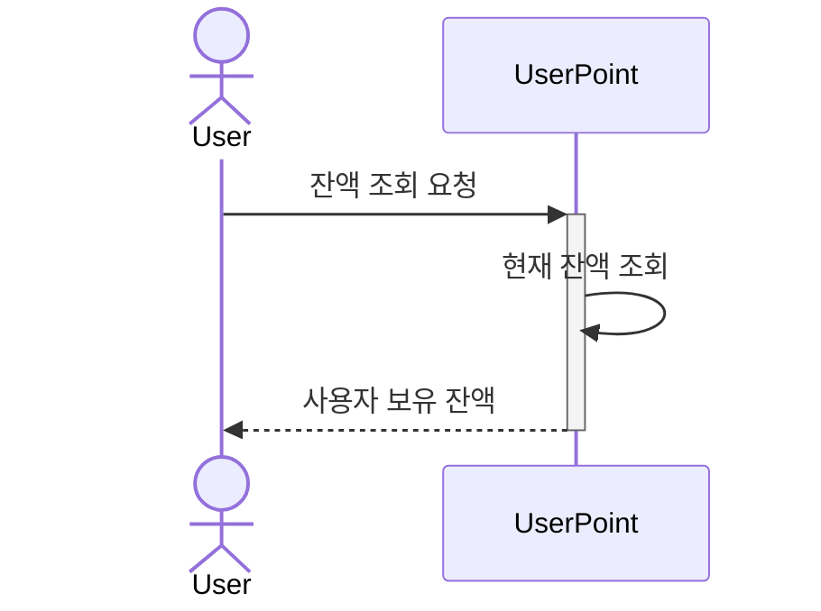
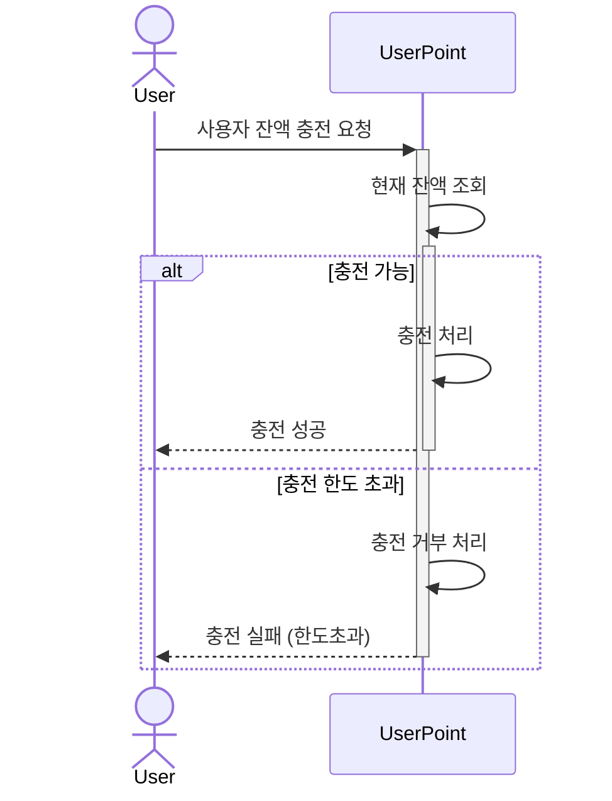
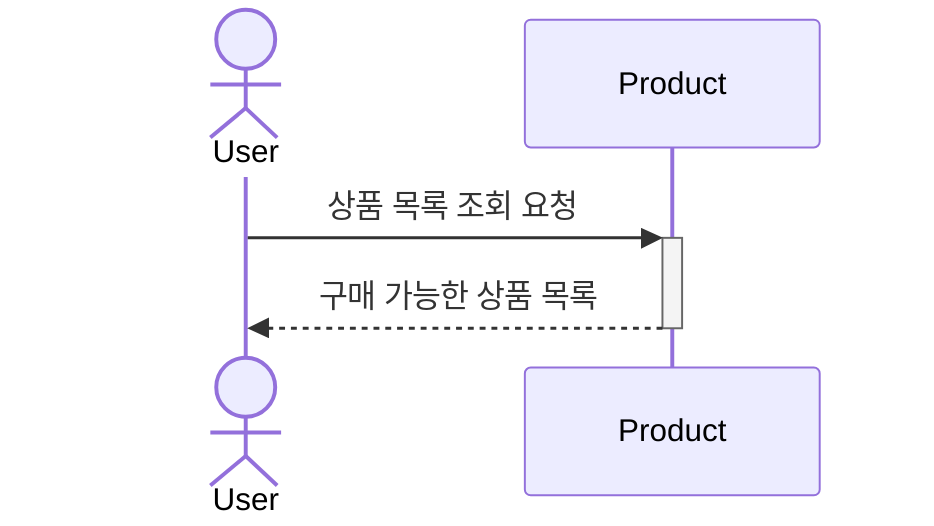
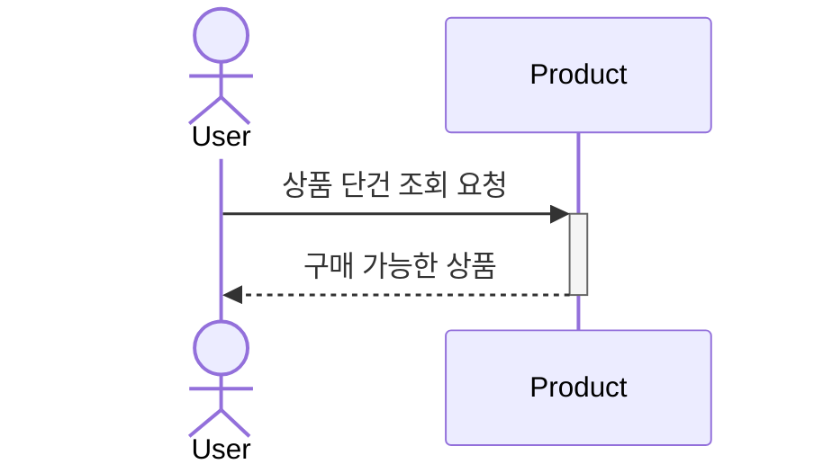
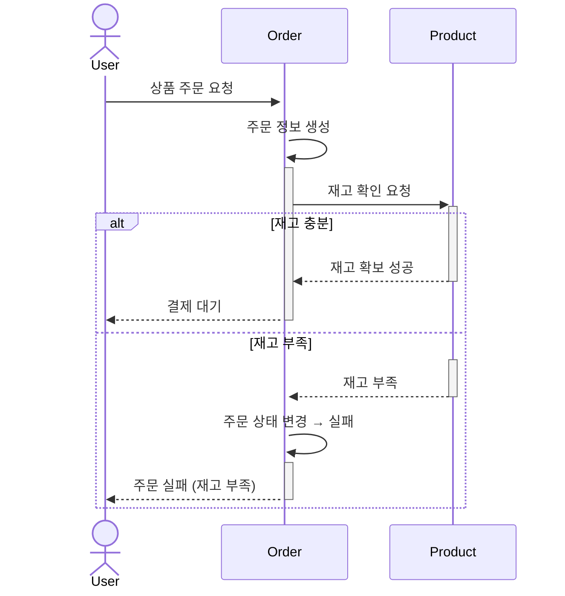
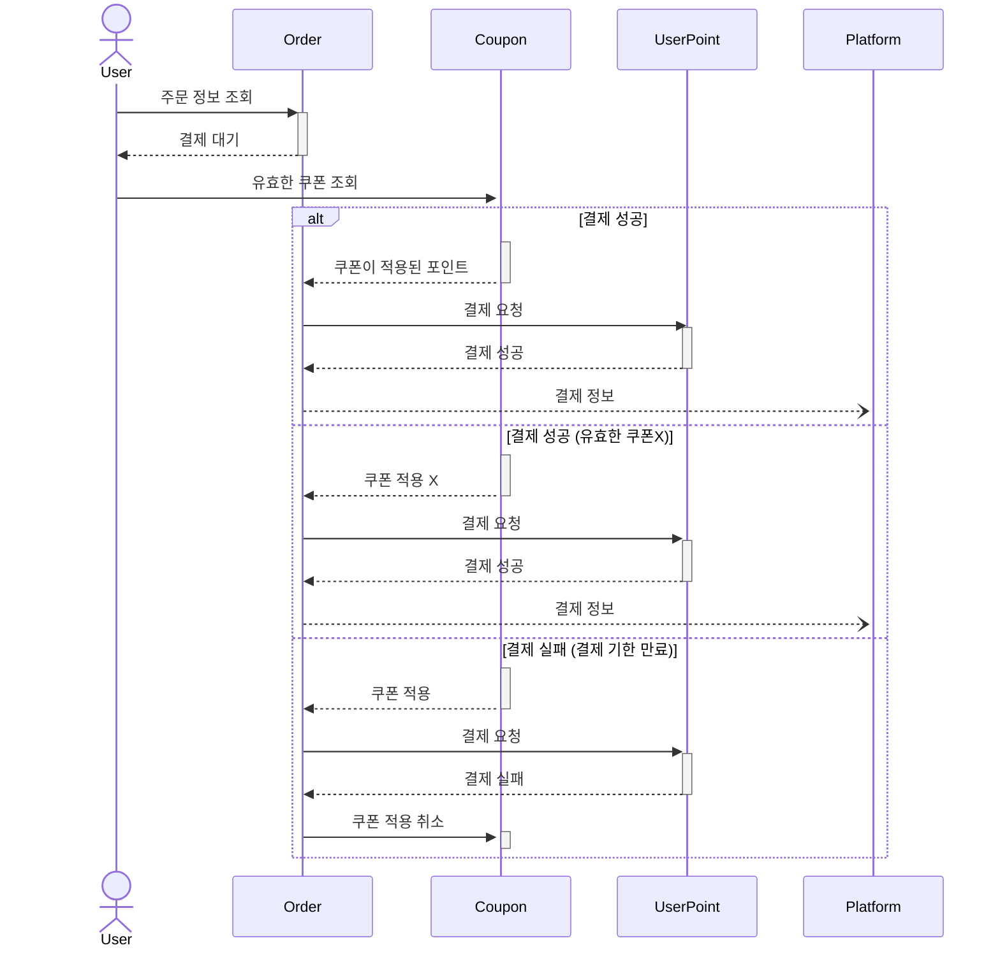
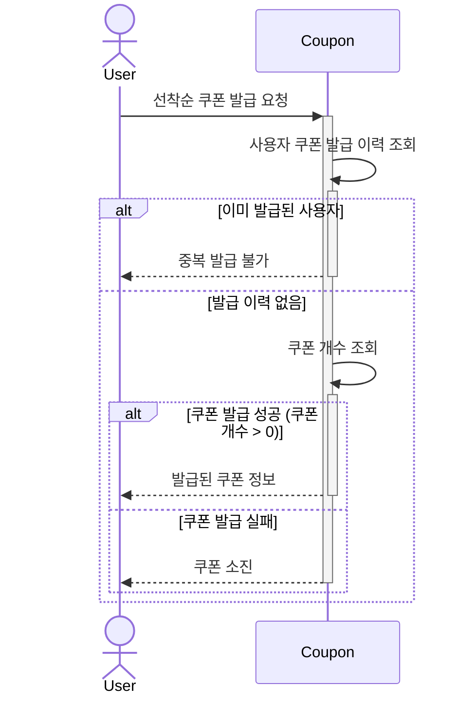
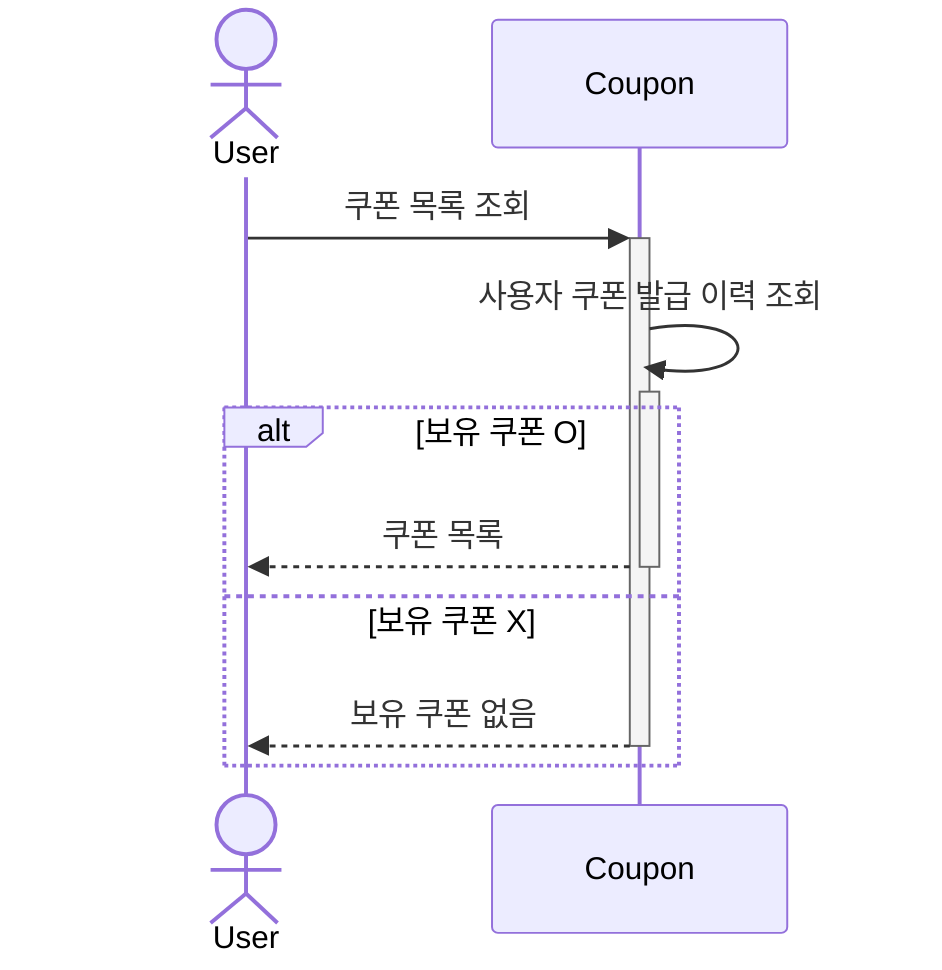
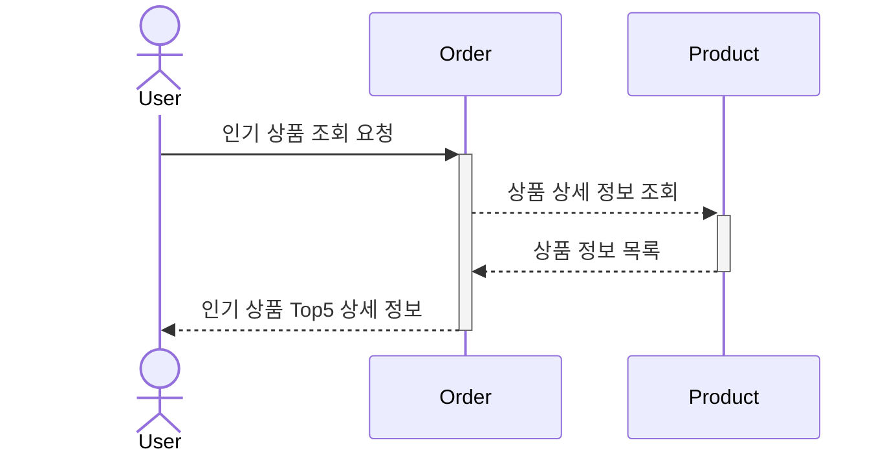

## 사용자 보유 잔액 조회

## 사용자 잔액 충전

## 상품 목록 조회

## 상품 단건 조회

## 주문
### 재고가 없다고 주문을 받지 않는다면 사용자의 서비스 이용 만족도가 떨어질 수 있음
- 선 주문 생성 후, 주문 상태 변경

## 결제

## 쿠폰 발급 요청

## 쿠폰 발급 목록 조회

## 인기 상품 조회
### 인기 상품 조회의 목적은 통계 
- 상품의 상세 정보를 표출할지 말지는 설계자의 마음인 것 같은데 상세 정보가 있어야지 이후 서비스 제공에 원활하지 않을까..?
